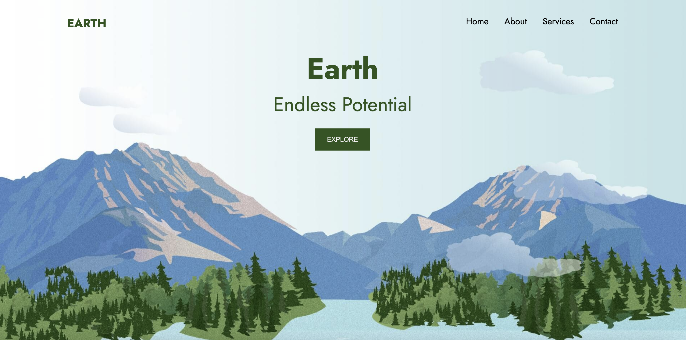
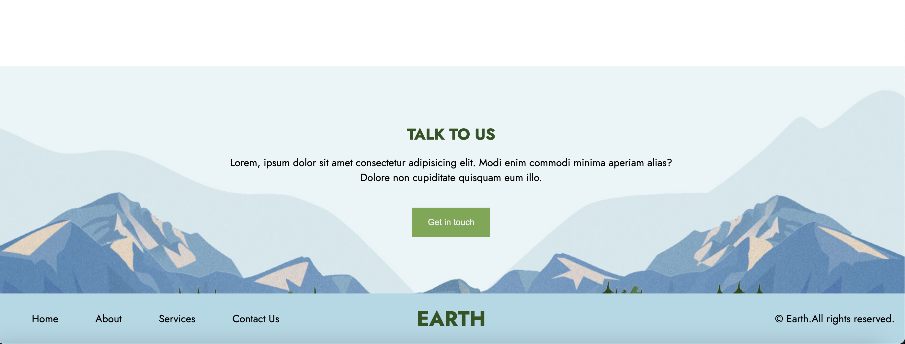
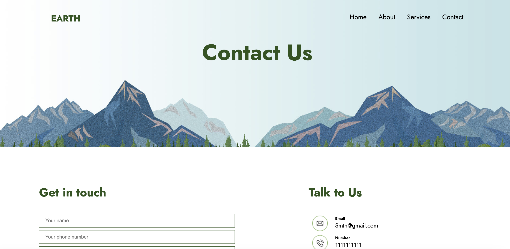
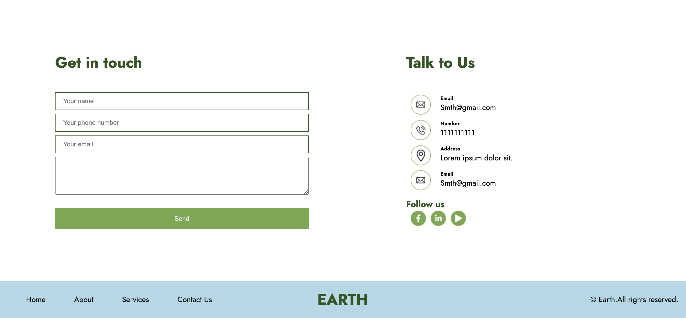

# Website Project

## Overview
This project is a simple website built using **HTML** and **CSS**. It demonstrates fundamental web development practices, including page layout, navigation, and styling with custom CSS.

## Features
- **Responsive Design**: The website adjusts to different screen sizes (desktop, tablet, and mobile).
- **Navigation Bar**: A fully functional navigation bar with links to different sections of the website.
- **Footer**: A footer that stays at the bottom of the page.
- **Typography and Styling**: Clean and modern styling with custom fonts and color schemes.
- **Sections**: Includes typical web sections like the homepage, about, services, and contact page.

## Technologies Used
- **HTML5**: Used for the structure and content of the website.
- **CSS3**: Used for layout, responsive design, and visual styling.

## How to Use
1. Clone or download the repository:
    ```bash
    git clone https://github.com/your-username/your-repo-name.git
    ```
2. Open the `index.html` file in your web browser to view the website.


## Customization
You can easily customize the website by editing the HTML files and modifying the `style.css` file to change colors, fonts, or layout.

## Future Enhancements
- Add more pages and content.
- Implement JavaScript for interactive features.
- Improve the design with advanced CSS animations and transitions.

## License
This project is open-source and available under the [MIT License](LICENSE).







